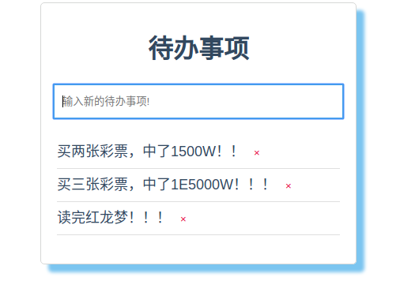

## TodoList

`TodoList`是使用`flask`+`vue`开发的前后端分离的待办事项小项目，是flask+vue开发前后端分离项目的最小实践。

### 开始


```bash
git clone https://github.com/weijiang1994/todolist.git
```

### 服务端

```bash
cd todolist/server
python3 -m venv venv
source venv/bin/activate
pip install -r requirements.txt
python app.py
```

### 客户端

```bash
cd todolist/client
npm install 
npm run serve
```

访问http://127.0.0.1:8080,效果如下图所示



